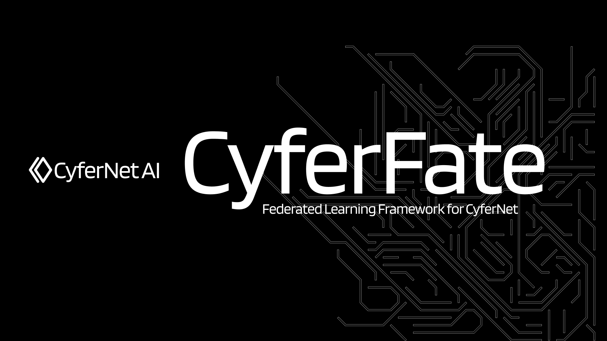

   

  

# CyferFate: CyferNet AI’s Decentralized Federated Learning Framework

CyferFate is CyferNet AI’s flagship open-source framework designed to empower enterprises and institutions to collaboratively train AI models on distributed data while ensuring top-tier data security and privacy. By integrating state-of-the-art secure computation protocols—including homomorphic encryption and multi-party computation (MPC)—CyferFate supports diverse federated learning scenarios ranging from logistic regression and tree-based algorithms to deep learning and transfer learning.

CyferFate is hosted under the auspices of CyferNet AI and adheres to a robust technical charter that defines contribution responsibilities and project oversight. You can review the [CyferFate Technical Charter](https://github.com/CyferNetAI/CyferFate-Community/blob/master/CyferFate_Technical_Charter.pdf) for detailed guidelines on technical contributions and community governance.

<https://cyferfate.docs.io/en/latest>

---

## Getting Started

CyferFate can be deployed on a single node for testing or scaled across multiple nodes to achieve enterprise-level performance, reliability, and manageability. Choose the deployment approach that best matches your environment:

- **Release Versions:**  
  Download the latest release from our [CyferFate Release Portal](https://github.com/CyferNetAI/CyferFate/wiki/Download).

### Version ≥ 2.0

#### Standalone Deployment

- **Single-Node Deployment:**  
  Deploy CyferFate on a single node using our PyPI package, pre-built Docker images, or dedicated installers. This approach is ideal for initial testing and development. Refer to our [Standalone Deployment Guide](./deploy/standalone-deploy/) for detailed instructions.

#### Cluster Deployment

- **Multi-Node Deployment:**  
  For large-scale, production-grade federated learning, deploy CyferFate across multiple nodes. Our framework supports:
  - **CLI-Based Cluster Deployment:** Use command-line tools to orchestrate a CyferFate cluster.
  - **Docker-Compose Deployment:** Leverage Docker Compose for rapid and reliable cluster setup.

---

## Quick Start

- **Training Demo – CyferFate Only:**  
  Follow our [Training Demo with CyferFate Installed from PyPI](doc/2.0/cyferfate/ml) for a streamlined introduction.
- **Integrated Deployment – CyferFate & CyferFlow:**  
  For a complete ecosystem experience, see our [Quick Start Guide for CyferFate and CyferFlow](doc/2.0/cyferfate/quick_start.md).

---

## Advanced Use

- **Privacy-Preserving (Homo Mode):**  
  Learn how to train and predict securely with CyferFate’s homo mode by following the [CyferFate Homo Mode Guide](./doc/2.0/cyferfate/homo_quick_start.md).
- **Running Advanced ML Modules:**  
  Explore how to run custom ML launchers with CyferFate by referring to our [Advanced ML Launcher Documentation](./doc/README.md#run-ml-modulessince-v200).

### More Examples

- **Machine Learning Examples:**  
  Check out our [ML Examples](examples/launchers) for practical applications.
- **Pipeline Examples:**  
  Explore our [Pipeline Examples](examples/pipeline) that demonstrate end-to-end federated modeling.

---

## Documentation

### CyferFate Design

- **Architecture:**  
  Discover how CyferFate builds a unified and standardized API to interconnect heterogeneous computing engines in our [Architecture Documentation](./doc/architecture/README.md).
- **Algorithm Components:**  
  Learn about the standardized components that power CyferFate’s secure federated algorithms in [CyferFate Algorithm Components](./doc/2.0/cyferfate/components/README.md).
- **Cross-Site Collaboration (CyferOSX):**  
  See how CyferFate facilitates open platform communication for decentralized learning in our [CyferOSX Guide](./doc/2.0/osx/osx.md).
- **CyferFlow Integration:**  
  For scheduling and orchestrating secure federated tasks, review [CyferFlow Documentation](https://github.com/CyferNetAI/CyferFlow/blob/main/doc/cyfer_flow.md).
- **Pipeline Design:**  
  Understand how CyferFate’s scalable federated DSL accelerates modeling with our [Pipeline Design Guide](https://github.com/CyferNetAI/CyferFate-Client/blob/main/doc/pipeline.md).
- **RoadMap & Resources:**  
  See our [RoadMap](./doc/images/roadmap.png) and review related papers and conference materials in [CyferFate Resources](./doc/resources/README.md).

### Developer Guides

- **DAG Usage:**  
  Get started with designing federated learning workflows using our [DAG Usage Guide](./doc/2.0/cyferfate/dag.md).
- **Component Development:**  
  Follow our [Component Development Guide](./doc/develop_guide/component_guide.md) to contribute new modules to CyferFate.

---

## Related Repositories (Projects)

- **CyferKube:**  
  An operational tool for deploying CyferFate on cloud-native infrastructures such as Kubernetes. [CyferKube](https://github.com/CyferNetAI/CyferKube)
- **CyferFlow:**  
  A secure task scheduling platform designed for decentralized federated learning pipelines. [CyferFlow](https://github.com/CyferNetAI/CyferFlow)
- **CyferBoard:**  
  Visualization tools for exploring and understanding your federated models. [CyferBoard](https://github.com/CyferNetAI/CyferBoard)
- **CyferServing:**  
  A high-performance serving system for models trained with CyferFate. [CyferServing](https://github.com/CyferNetAI/CyferServing)
- **CyferCloud:**  
  Infrastructure tools for managing federated learning cloud services with CyferFate. [CyferCloud](https://github.com/CyferNetAI/CyferCloud)
- **EggRoll:**  
  A lightweight, high-performance computing framework for federated learning—compatible with CyferFate. [EggRoll](https://github.com/WeBankFinTech/eggroll)
- **AnsibleCyfer:**  
  Tools to automate configuration and deployment of CyferFate clusters using Ansible. [AnsibleCyfer](https://github.com/CyferNetAI/AnsibleCyfer)
- **CyferBuilder:**  
  Build packages and Docker images for rapid CyferFate deployment. [CyferBuilder](https://github.com/CyferNetAI/CyferBuilder)
- **CyferClient:**  
  A fast modeling tool to enable decentralized federated learning tasks in CyferFate. [CyferClient](https://github.com/CyferNetAI/CyferClient)
- **CyferTest:**  
  An automated testing suite for benchmarking CyferFate performance and security. [CyferTest](https://github.com/CyferNetAI/CyferTest)
- **CyferLLM:**  
  A framework to support federated learning for large language models within the CyferFate ecosystem. [CyferLLM](https://github.com/CyferNetAI/CyferLLM)

---

## Governance

The [CyferFate-Community](https://github.com/CyferNetAI/CyferFate-Community) repository houses all documentation on community collaboration, including:

- **Governance Model:**  
  Refer to [GOVERNANCE.md](https://github.com/CyferNetAI/CyferFate-Community/blob/master/GOVERNANCE.md) for project governance details.
- **Meeting Minutes:**  
  Review the minutes from our working sessions in [Community Meeting Minutes](https://github.com/CyferNetAI/CyferFate-Community/blob/master/meeting-minutes).
- **Development Process Guidelines:**  
  Follow the [Development Process Guidelines](https://github.com/CyferNetAI/CyferFate-Community/blob/master/CyferFate_PROJECT_PROCESS_GUIDELINE.md) for contribution standards.
- **Security Release Process:**  
  See our [Security Guidelines](https://github.com/CyferNetAI/CyferFate-Community/blob/master/SECURITY.md) for secure development practices.

---

## Getting Involved

### Contributing

CyferFate welcomes contributions from developers worldwide. Whether you’re submitting code, reporting bugs, or suggesting new features, please review our [Contributing Guidelines](https://github.com/CyferNetAI/CyferFate-Community/blob/master/CONTRIBUTING.md) to get started.

### Mailing List

Join the CyferFate user mailing list to stay updated on the latest developments, share feedback, and connect with the community. Visit our [CyferFate Mailing List](https://groups.io/g/CyferFateFedAI) for more information.

### Bug Reports and Feature Requests

File issues or feature requests via our [GitHub Issues Page](https://github.com/CyferNetAI/CyferFate/issues). For support or queries, reach out via our mailing list.

### Contact

- **Maintainers:**  
  CyferFate-maintainers [at] groups.io  
- **Security Inquiries:**  
  CyferFate-security [at] groups.io

### Social Media

Follow us on Twitter: [@CyferFateAI](https://twitter.com/CyferFateAI)

### FAQ

For common questions and troubleshooting, please visit our [CyferFate FAQ](https://github.com/CyferNetAI/CyferFate/wiki).

---

## License

CyferFate is released under the [Apache License 2.0](LICENSE).

---

By leveraging a robust, open-source framework with advanced secure computation protocols, CyferFate sets a new standard for federated learning—empowering organizations to collaboratively build powerful AI models without compromising data privacy.

This interconnected ecosystem of tools and documentation ensures that CyferFate remains at the forefront of secure, scalable, and privacy-preserving federated learning.
